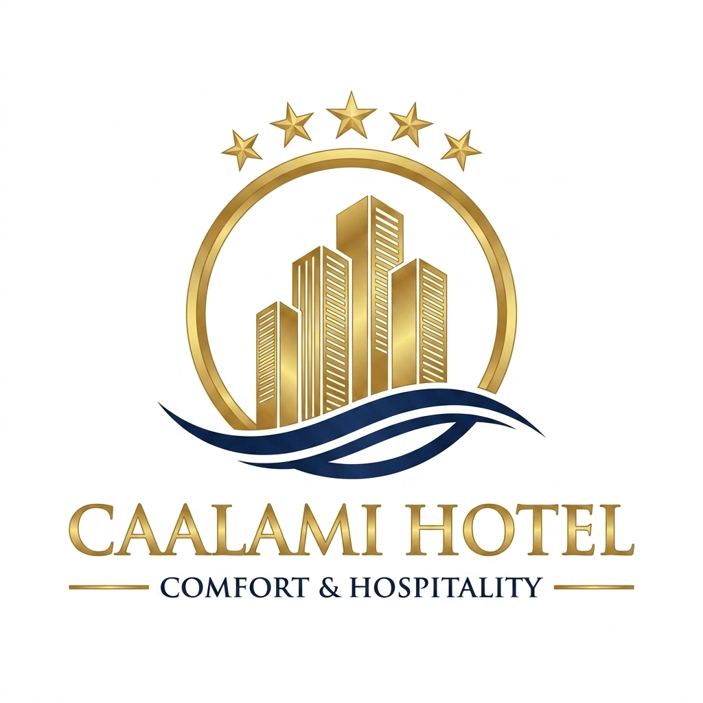

# 🏨 Caalami Hotel Management System

<p align="center">
  
</p>

<p align="center">
  <b>Comfort & Hospitality — Hotel Management System v2.0</b><br/>
  Built with C# Windows Forms + SQL Server LocalDB
</p>

<p align="center">
  
  
  
  
  
</p>

---

## 📋 About

**Caalami Hotel Management System** is a full-featured desktop application built for **Caalami Hotel, Hargeisa — Somaliland**. It provides a complete solution for managing hotel rooms, bookings, guests, staff, and revenue reporting.

---

## ✨ Features

### 🔐 Authentication
- Secure Login with role-based access (Admin / Staff)
- User registration & management

### 🏠 Room Management
- Interactive **Room Map** with color-coded status tiles
- Floor tabs for floor-by-floor navigation
- Room statuses: `Clean / Ready` 🟢 · `Dirty / Cleaning` 🟡 · `Maintenance` 🟠 · `Occupied` 🔴
- Auto-sets room to **Dirty** after guest checkout

### 👥 Guest & Booking Management
- Full booking flow: Check-in → Stay → Check-out
- Auto-generated Invoice (PDF saved to Desktop)
- Booking history with search & filter

### 📊 Dashboard & Reports
- Revenue summary (7-day bar chart)
- Room occupancy overview
- Real-time statistics cards

### 👤 User Management (Admin)
- Add / Edit / Deactivate staff accounts
- Role assignment (Admin / Staff)
- Activity audit log

---

## 🖥️ Screenshots

| Login Screen | Admin Dashboard | Room Map |
|:---:|:---:|:---:|
|  |  |  |

---

## 🚀 Installation — New Computer Setup

### Requirements
- Windows 10 / 11 (64-bit)
- [.NET Framework 4.8](https://dotnet.microsoft.com/download/dotnet-framework/net48) *(usually pre-installed)*
- [SQL Server LocalDB](https://learn.microsoft.com/en-us/sql/database-engine/configure-windows/sql-server-express-localdb) *(free — comes with Visual Studio)*

### Step 1 — Setup Database
```
2_DATABASE_SETUP\SETUP_DATABASE.bat
→ Right-click → "Run as Administrator"
→ Wait for "DATABASE DIYAAR / SETUP COMPLETE"
```

### Step 2 — Run the App
```
1_APP_FUR_HALKAN\CaalamiHotel_App.exe
→ Double-click to launch
→ Username: admin
→ Password: admin123
```

---

## 🏗️ Build from Source

### Requirements
- Visual Studio 2022
- .NET Framework 4.8 SDK

### Steps
```bash
git clone https://github.com/Abdikadirkosar/CaalamiHotel.git
cd CaalamiHotel/WindowsFormsApp1
# Open "Hotel Management System 2.sln" in Visual Studio
# Build → Release → Run
```

---

## 🗂️ Project Structure

```
CaalamiHotel/
│
├── WindowsFormsApp1/          # Main C# WinForms project
│   ├── AdminMainForm.cs       # Admin panel
│   ├── staffMainForm.cs       # Staff panel
│   ├── Form1.cs               # Login screen
│   ├── SplashForm.cs          # Splash/loading screen
│   ├── admin_dashboard.cs     # Dashboard + charts
│   ├── admin_rooms.cs         # Room management + map
│   ├── admin_customers.cs     # Guest & booking management
│   ├── admin_addUser.cs       # User management
│   ├── hotelData.cs           # DB connection + data helpers
│   ├── Program.cs             # App entry + DB auto-setup
│   └── assets/                # Logo + icons
│
├── SQLQuery1.sql              # Database schema reference
└── README.md
```

---

## 🛠️ Tech Stack

| Component | Technology |
|---|---|
| Language | C# (.NET Framework 4.8) |
| UI Framework | Windows Forms (WinForms) |
| Database | SQL Server LocalDB |
| Charts | Custom GDI+ drawing |
| IDE | Visual Studio 2022 |

---

## 🔄 Room Status Lifecycle

```
🟢 Clean / Ready
      ↓  (booking made)
🔴 Occupied
      ↓  (guest checks out — AUTOMATIC)
🟡 Dirty / Cleaning
      ↓  (staff cleans & updates manually)
🟢 Clean / Ready
```

---

## 👨‍💻 Developer

**Abdikadir Kosar**
📧 abdikadirkosara@gmail.com
🌍 Hargeisa, Somaliland

---

## 📄 License

This project is private and developed for **Caalami Hotel, Hargeisa — Somaliland**.

---

<p align="center">
  <b>🏨 Caalami Hotel — Comfort & Hospitality</b>
</p>